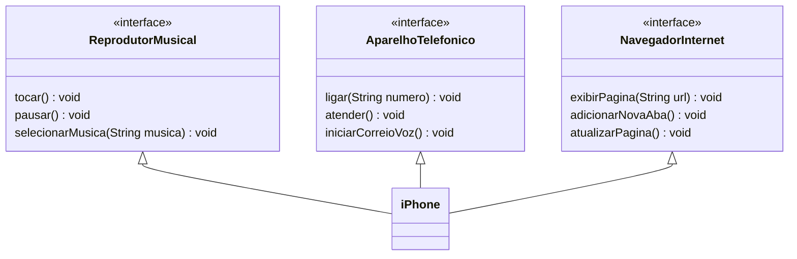

# Desafio POO Java - iPhone em diagramação e modulagem
## Definição
Desafio da DIO para Programação Orientada a Objetos em Java. O objetivo é praticar em um projeto que consiste em diagramar e modelar uma representação em UML do componente iPhone. Nele abrange-se suas funcionalidades como Reprodutor Musical, Navegador de Internet e Aparelho Telefônico.

### Referência
A Principal referência usada para esse projeto é através do vídeo do lançamento do iPhone, feito em 2007. Com isso, foi elaborado a diagramação das classes e interfaces utilizando uma ferramenta UML de preferência do usuário. Depois foi implementado as classes e interfaces no formato de arquivos `.java`.

[Lançamento do iPhone em 2007](https://youtu.be/9ou608QQRq8?si=Em0Gu2Y--3LaZRnQ)

## Diagrama UML (Mermaid)

### Funcionalidades modeladas

1. Reprodutor Musical
    - Métodos: `tocar()`, `paudar()`, `selecionarMusica(String musica)`

2. Aparelho Telefônico
    - Métodos: `ligar(String numero)`, `atender()`, `iniciarCorreioVoz()`

3. Navegador de Internet
    - Métodos: `exibirPagina(String url)`, `adicionarNovaAba()`, `atualizarPagina()`

## Código do Projeto (Java)
Acesse o projeto `desafio-iPhone` na pasta anexada ao repositório.